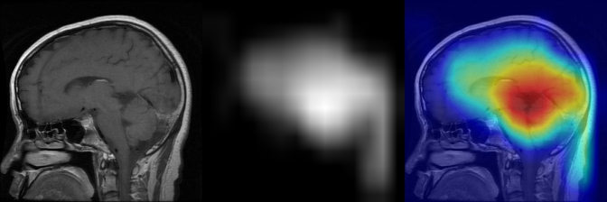
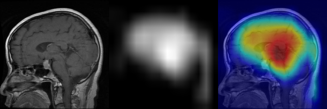

# 🧠✨ Explainable Brain Tumor Classification

Welcome to the **Explainable Brain Tumor Classification** project! Here, we turn **MRI scans** into actionable insights by classifying brain tumors 🧠 and making the model’s decisions interpretable using **state-of-the-art explainable AI (XAI) techniques** 🔍.

## 🚀 Features

- 🖼️ **MRI-Based Brain Tumor Classification**  
  Classifies MRI scans into different tumor types with high accuracy.  

- 🔍 **Explainability with CAM Methods**  
  See *exactly* where the model is looking! We use:  
  - **Grad-CAM** 🌟  
  - **Grad-CAM++** ⚡  
  - **Score-CAM** 🎯
  - ...

- 📊 **Visual Results in `imgs` Folder**  
  Check out how the model highlights tumor regions in your MRI scans. Clear, visual explanations for every prediction!  

## 🖼️ Sample Results

### Grad-CAM

### Grad-CAM++

> 💡 **Tip:** Use these visualizations to understand which regions influence the model’s predictions the most! Perfect for research, diagnostics, or just exploring AI in healthcare.
